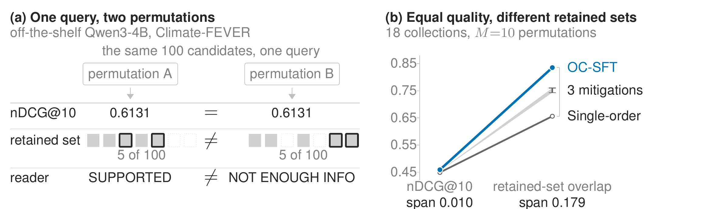

# presentation_dependence

Research code for the paper *Equal ranking quality, different decisions:
presentation dependence in batched scoring*. A language model that scores
several candidates in one prompt conditions each score on the whole prompt, so
reordering the same candidates changes which documents a threshold retains, what
a frozen reader answers, and which response a preference model selects. This
repository contains the τ-PSI implementation that measures that dependence, the
evaluation and PSI runners around it, and the training code for the objectives
compared in that manuscript.

Reproduction is post-hoc and best-attempt: re-execution should  be close to the published numbers rather than match them exactly, for the reasons in [reproduction fidelity](docs/REPRODUCE.md#reproduction-fidelity).

Evaluation collections are read from `data/<dataset-name>/`. Legal-A and Legal-B are
proprietary and are not distributed with this repository; they are [not needed
to reproduce the public conclusions](#results).

## Scope

This is a source-only research release. It includes code, configurations,
documentation, and aggregate paper evidence; it does not include datasets,
downloaded indexes, model weights, checkpoints, adapters, silver labels,
credentials, hosted-model requests or responses, or container images.

For research reproduction and for measuring presentation dependence in other
batched or listwise scorers. Quality and τ-PSI both move with the first stage,
`B`, and truncation: re-measure on your own dataset before relying on these
numbers. Equal nDCG does not imply stable decisions; if you care about retained
sets, reader answers, or preference picks, measure τ-PSI as well. Scores are
graded relevance estimates, not factuality or legal judgments. Do not use this
for high-stakes decisions about people. Upstream dataset and model terms apply
([THIRD_PARTY_NOTICES.md](THIRD_PARTY_NOTICES.md)); security issues go through
[SECURITY.md](SECURITY.md).

## Contents

- [Scope](#scope)
- [Results](#results)
- [How it works](#how-it-works)
- [Key terms](#key-terms)
- [Installation](#installation)
- [Quick start](#quick-start)
- [Repository map](#repository-map)
- [Legacy identifiers](#legacy-identifiers)
- [Configuration](#configuration)
- [Models and rerankers](#models-and-rerankers)
- [Evaluation datasets](#evaluation-datasets)
- [Extending the pipeline](#extending-the-pipeline)
- [Documentation](#documentation)
- [Development checks](#development-checks)
- [License and citation](#license-and-citation)


## Results



**Figure 1: The same candidates reordered give the same nDCG@10 but a different
decision.** (a) Each chip is one document, in the same position in both rows
rather than by rank: solid where retained, dotted where not, outlined where they
disagree. (b) Five trained scorers; values in Table 1.

The paper's full Table 1 is shown below. It reports Qwen3-4B with ten
random permutations; trained rows are three-seed means. Passage reranking
averages 18 collections (including the two undistributed internal collections),
multi-document QA averages three, and response ranking averages five. Higher is
better for nDCG and Jaccard; lower is better for τ-PSI and flip rates.

| Variant                  | Rerank nDCG@10 | Rerank τ-PSI | Rerank Jacc. | QA nDCG@10 | QA τ-PSI | QA answer flip | Response nDCG@1 | Response τ-PSI | Response pair flip |
| --------------------------| ---------------:| -------------:| -------------:| -----------:| ---------:| ---------------:| ----------------:| ---------------:| -------------------:|
| Off the shelf            | 0.370          | 0.298        | 0.439        | 0.911      | 0.224    | 0.221          | 0.655           | 0.345          | 0.877              |
| CapCal                   | 0.372          | 0.293        | 0.427        | 0.911      | 0.222    | 0.217          | 0.657           | 0.338          | 0.874              |
| Round-robin              | 0.422          | 0.297        | 0.443        | 0.911      | 0.224    | 0.221          | 0.658           | 0.347          | 0.878              |
| BSC (×10)¹               | 0.465          | 0.180        | 0.707        | 0.946      | 0.143    | 0.157          | 0.716           | 0.184          | 0.636              |
| jina-reranker-v3         | 0.447          | 0.177        | 0.667        | 0.949      | 0.163    | 0.172          | 0.479           | 0.226          | 0.685              |
| GPT-5.4²                 | 0.468          | —            | 0.707        | 0.972      | —        | 0.094          | 0.726           | —              | 0.489              |
| Single-order             | 0.449          | 0.209        | 0.656        | 0.951      | 0.159    | 0.177          | 0.684           | 0.333          | 0.869              |
| Order-averaged           | 0.455          | 0.130        | 0.743        | 0.956      | 0.124    | 0.149          | 0.693           | 0.228          | 0.724              |
| DebiasFirst              | 0.454          | 0.128        | 0.759        | 0.955      | 0.147    | 0.164          | 0.694           | 0.228          | 0.718              |
| Permutation augmentation | 0.455          | 0.129        | 0.760        | 0.955      | 0.148    | 0.162          | 0.696           | 0.223          | 0.707              |
| OC-SFT                   | 0.459          | 0.083        | 0.835        | 0.961      | 0.096    | 0.125          | 0.701           | 0.201          | 0.661              |

¹ BSC's instability and decision cells compare four independent ten-permutation
ensembles; every other row compares single permutations at one tenth of the
inference cost. ² GPT-5.4 produces many ties; the paper uses an order-independent
tie-break and therefore omits τ-PSI.

Five trained scorers within 0.010 reranking nDCG@10 span 0.656–0.835 in
retained-set overlap. OC-SFT also has the lowest answer-flip and pair-flip
rates among the trained scorers.

## How it works

For primary passage reranking, the score readout turns an off-the-shelf chat
model into a per-document scorer without decoding. The prompt carries a grading
instruction, the query, and `B=20` documents, each tagged `[i]` and truncated to
about 1200 characters, and
asks for one integer grade in `{0,1,2,3}` per document. Rather than sampling
grades, a fixed answer skeleton pins the position of every grade token, so one
forward pass reads the probability over the four grade tokens at each slot and
takes the expected grade `E[g] = Σ g·P(g)` as the score. One pass yields all `B`
scores, and since nothing is generated there is nothing to mis-parse.
[docs/SCORING.md](docs/SCORING.md) is the exact contract. Legacy
`Path-C` / `pathc` identifiers are explained under
[Legacy identifiers](#legacy-identifiers).

The same readout is used at task-specific geometry: B=10 over ten passages for
multi-document QA, and B=4 over response sets of 4, 7, 8, 8, and 6 candidates
(sets larger than four are chunked).

Training distills a teacher's silver labels under a squared-error score loss.
The three variants differ only in the labels and whether they add the
consistency penalty:


| Variant | Silver labels | Consistency loss | Teacher permutations `T` | Student views `N` |
| --- | --- | --- | ---: | ---: |
| Single-order distillation | one teacher order | no | 1 | 1 |
| Order-averaged distillation | mean over teacher orders | no | 10 | 1 |
| OC-SFT | one teacher order | yes, across shuffled views | 1 | 2 |


OC-SFT adds `λ · mean_d (s_A(d) - s_B(d))²` over two shuffled views A and B of
the same chunk, driving the order-dependent part of the score toward zero from
single-order labels. Passage reranking selects `λ` on held-out MS MARCO; QA uses
a disjoint held-out HotpotQA split; the reported response-ranking λ is set
a priori per scale. See [docs/EVAL-PROTOCOL.md](docs/EVAL-PROTOCOL.md); do not
hand-pick from final test results.

## Key terms

Canonical paper names, internal aliases, and notation are collected in
[`docs/TERMINOLOGY.md`](docs/TERMINOLOGY.md).

- `First stage`: the retriever, BM25 here, that proposes the top-100 candidates
a reranker reorders. A reranker cannot exceed its recall.
- `B`: documents scored in one prompt, `B=20`, so five chunks cover the top 100.
- `M`: random evaluation permutations used to estimate order instability and
decision flips.
- `T`: teacher permutations averaged into an order-averaged distillation target.
- `N`: student views in one OC-SFT training step.
- `K`: self-consistency passes. At K=1 the candidates are scored once in their
given order, which is the deployment case; at K>1 scores are averaged over K
shuffled orders.
- `Batched self-consistency (BSC)`: the K=10 order-averaging ensemble that
OC-SFT amortizes into one serving presentation.
- `GenBSC` / `closed_model_generated_bsc`: BSC labels or scores from a hosted
chat API (integer grades averaged over shuffled orders) rather than from a
local expected-grade logit readout. The paper calls the label-generation count
`T` and the serving-time BSC count `K`. Recipe in
`ClosedModelGenBscReranker` and the closed-teacher silver configs; the
GPT-5.4-distilled student is not among the eleven adapters below.
- `τ-PSI`: rank-level order-instability index over M shuffled orders,
`(1 − mean Kendall τ) / 2`. Zero is identical rankings, 0.5 is uncorrelated,
lower is better. This is the manuscript's primary order-instability metric.
- `Zeng PSI`: quality-bucket position-sensitivity `1 − min(s)/max(s)` on
position-specific nDCG@10 (Zeng et al.). Corpus form is `zeng_psi_corpus` in
`psi_metrics.json`. Same formula family as τ-PSI's neighbour, different
input; do not mix the two when reporting. Always record the perturbation that
produced the number.
- `Silver labels`: continuous teacher relevance scores used as SFT targets, with
no human labels.
- `OC-SFT`: order-consistency SFT, single-order distillation plus the
paired-view consistency penalty.


## Installation

You need Python 3.11 and `uv`, on macOS or Linux. Everything resolves from PyPI.
Java 21 is needed only for pyserini-backed retrieval, and a CUDA GPU only for
training and vLLM inference; the smoke path below needs neither.

The documented operator workflows require a source checkout. The wheel is a
library-only import artifact: it contains `presentation_dependence` but no console entry
points, `scripts/`, experiment configs, or root documentation. Do not expect a
wheel-only installation to run the commands below.

```bash
./setup.sh                    # dev environment; downloads on a cold cache
./setup.sh --full             # adds training, reranker, analysis and dense extras
uv run --no-sync poe ci       # network-free gate after setup has completed
```

`--full` deliberately does not install vLLM. It stays opt-in because it is
CUDA-only; add `--extra vllm` to the `uv run` command that needs it. The local
Python 3.11 extra is the Qwen-compatible vLLM 0.10.2 stack. Gemma-4 serving uses
the separate Python 3.13/CUDA 13 container described in
[docs/HARDWARE.md](docs/HARDWARE.md).
Setup registers a user Jupyter kernel by default; pass `--no-kernel` on a
headless or shared machine.

```bash
export HF_TOKEN=...                # Hub access, needed for most bases
export JAVA_HOME=...               # pyserini
export SLM_NUM_GPUS=8              # only to override the detected GPU count
```

`.env.example` is a key-name template. Never commit populated credentials.

Jobs autodetect their GPUs and run on device 0 unless told otherwise;
[docs/HARDWARE.md](docs/HARDWARE.md#using-more-than-one-gpu) covers device
selection and the three ways to use more than one.

## Quick start

Everything under `data/` is gitignored, so a fresh checkout has no first-stage
inputs. Follow the checks in order; the real-model path adds network, Java,
fixture construction, model access, and an accelerator.

Verify the install with no data, network, GPU, or Java. The zero-dependency
smoke builds a synthetic fixture and runs it through the full
`ExperimentManager` to `EvalManager` to `pytrec_eval` path. The identity
reranker passes the fixture's deliberately imperfect order through unchanged, so
the result is a fixed nDCG@10 of 0.6805, a plumbing check rather than a result:

```bash
uv run --no-sync poe smoke
```

Expanded form (same path as the `poe` task):

```bash
uv run python scripts/data/build_smoke_fixture.py
uv run python scripts/run_experiment.py -e configs/experiments/_smoke-fixture.yaml
uv run python scripts/run_eval.py -e _smoke-fixture
uv run python scripts/check_smoke_result.py
```

Materialize the public automated passage data. This needs network and Java 21
and downloads pyserini indexes, about 1.5 GB for MS MARCO and several GB more
for the full BEIR cache. `plan` is read-only, and task-level `run` deliberately
skips gated and manual rows:

```bash
uv run python scripts/setup_reproduction_data.py plan --task passage-reranking
uv run python scripts/setup_reproduction_data.py run --task passage-reranking
```

The expected-grade example uses `FixtureLoader`, whereas the unified setup step
materializes a Pyserini run, topics, and qrels. Build its self-contained DL19
fixture explicitly:

```bash
uv run python scripts/data/build_fixture_pyserini.py \
  --topics data/dl19-passage/topics.tsv \
  --run data/dl19-passage/run.msmarco-v1-passage.bm25-default.dl19_sorted.txt \
  --index msmarco-v1-passage \
  --k 100 \
  --out data/dl19-passage/fixture.jsonl
```

The flags are explicit because `-e` reads the first stage out of a config, and
this one is already a `FixtureLoader` config naming the fixture being built.

Run a real reranker on DL19 using the expected-grade readout. This downloads
model weights:

```bash
RUN_DIR="runs/example-passage-b20-psi/$(date +%Y%m%d_%H%M%S)"
uv run python scripts/run_experiment.py \
  -e configs/experiments/example-passage-b20-psi.yaml --run-dir "$RUN_DIR"
uv run python scripts/run_eval.py -e "$RUN_DIR"
uv run python scripts/run_psi.py \
  -e configs/experiments/example-passage-b20-psi.yaml --run-dir "$RUN_DIR"
```

`run_experiment.py` reranks, `run_eval.py` scores a run directory, and
`run_psi.py` runs the K-permutation robustness evaluation, writing τ-based PSI,
corpus-level Zeng PSI, Kendall τ, delta-nDCG, and per-document score and rank
variance to `$RUN_DIR/psi/psi_metrics.json`. Always record which perturbation
produced a number, since `random_shuffle` and `middle_injection` are not
comparable.

Pinning `--run-dir` is what keeps the three phases together. Each command
otherwise mints its own `runs/<ID>/<timestamp>/`, so `metrics.json` and
`psi/psi_metrics.json` would describe the same config from two directories.
[docs/RUN-ARTIFACTS.md](docs/RUN-ARTIFACTS.md) describes the resulting
layout.

[docs/REPRODUCE.md](docs/REPRODUCE.md) carries the full walkthrough, from the
zero-dependency smoke and first real-data check to the complete task matrix.

## Repository map

```text
configs/
  experiments/   runnable eval and PSI configs, flat, one file per experiment ID
  self-distill/  student training configs
  silver/        teacher configs, open-weight and hosted
  reader/        frozen-reader and verdict configs
  studies/       scientific study definitions
  reproduction/  task pipelines, populations, source lock, appendix registry
  sweeps/        launch matrices

src/presentation_dependence/
  rerankers/     inference wrappers and the RankResult contract
  eval/          ExperimentManager, EvalManager, PSI, reduction primitives
  self_distill/  engines, teacher, student, silver IO, selection
  silver_data/   hosted-teacher clients and generation
  reader/        answer and verdict reader pipelines
  analysis/      post-hoc metrics and representative checks
  reproduction/  task lifecycle, collection, audits
  utils/         config, TREC, paths, sweeps, provenance

scripts/
  run_*.py       local entry points
  study.py       task, stage and appendix CLI
  data/          dataset materialization and fixtures
  analyze/       appendix analyzers and probes
  train*/        container entry points and Dockerfiles
```

Runs land in `runs/<ID>/<timestamp>/`, collected results in
`build/reproduction/`, and both are gitignored. Only execution and collection
code reads `runs/`; analyzers read `build/reproduction/`. Reruns of the same
config are additive, reusing existing per-query results, so delete
`per_query_results/` to force a full re-run.

Historical ID tokens (`supcon`, `Path-C` / `pathc`, and older prefixes) are
listed under [Legacy identifiers](#legacy-identifiers). Use semantic IDs for new
work and do not rename an existing one.

### Legacy identifiers

Stored run directories and evidence mappings keep some historical tokens. They
are not new APIs; treat them as frozen spellings.


| Token                                                    | Means                                                              | Where it still appears                                                                                          |
| -------------------------------------------------------- | ------------------------------------------------------------------ | --------------------------------------------------------------------------------------------------------------- |
| `supcon`                                                 | OC-SFT (order-consistency / supervised consistency)                | Some experiment and study IDs, comments, and analyzer stems                                                     |
| `k1-sft` / `k1sft`                                       | Single-order distillation                                           | Config IDs, run paths, and serialized variant keys                                                              |
| `k10-sft` / `k10sft`                                     | Order-averaged distillation                                         | Config IDs, run paths, and serialized variant keys                                                              |
| `posaug` / `shuffled-view-augmentation`                   | Permutation augmentation                                            | Config IDs, run paths, and serialized variant keys                                                              |
| `Path-C` / `pathc`                                       | Expected-grade readout contract (prompt + skeleton + grade logits) | Prompt template id `pathc_grade_v1`, helper names like `build_pathc_grade_user_body`, and older config comments |
| Prefixes `R*`, `L*`, `A8*`, `a1`, `a2`, `P7`, `RR`, `SE` | Historical run-family labels                                       | Run directories and evidence mappings                                                                           |


Live schema values that look short but are not legacy prefixes: context-
decomposition arms `A1`–`A4` and reader phases `R3` / `V3`.

## Configuration

Each experiment is a flat YAML at `configs/experiments/<ID>.yaml`, and that ID is
the run-directory key. Any field is overridable with a dotted
`--override key=value`, parsed as YAML. A minimal config has three blocks:

```yaml
id: example-passage-mxbai-large-v2
reranker:
  class: MxbaiPointwise               # a key in rerankers/registry.py
  model_name: mixedbread-ai/mxbai-rerank-large-v2
  device: auto
  batch_size: 32
data:
  dataloader_class: PyseriniLoader    # or FixtureLoader for index-free datasets
  topics: dl19-passage
  index: msmarco-v1-passage
  run_path: data/dl19-passage/run.msmarco-v1-passage.bm25-default.dl19_sorted.txt
  k_input: 100                        # candidates per query
eval:
  qrels_path: data/dl19-passage/qrels.txt
  measures: [ndcg_cut_10, map, recip_rank]   # pytrec_eval measure names
```

`robustness`, `matched_variance_control`, `pool_perturbation`,
`context_decomposition`, and `bundle` are the optional blocks. Precedence runs
tracked YAML, then environment overrides, then dotted CLI overrides, with the
result frozen into each run's `resolved_config.yaml`. Keep
`configs/experiments/` flat and keep IDs stable, since run directories and the
results index key off them.

Full schema: [configs/experiments/_schema.md](configs/experiments/_schema.md).
Search configs with `uv run python scripts/list_experiment_configs.py`.

Experiment configs are per-job. The pipeline definitions that generate them, one
per task, live in `configs/reproduction/` and are documented in
[configs/reproduction/_schema.md](configs/reproduction/_schema.md).

## Models and rerankers

Each reranker is one file under `src/presentation_dependence/rerankers/`, registered by
class name in `registry.py` and referenced from a config's `reranker.class`.
Every one subclasses `Reranker`, implements `rank(query, passages)`, returns a
`RankResult` preserving input passage identity and order, and declares its
paradigm.


| Class                                           | Role                             | Notes                                                                          |
| ----------------------------------------------- | -------------------------------- | ------------------------------------------------------------------------------ |
| `Qwen3InstructGradeReranker`                    | OC-SFT scorer                    | main OC-SFT base and default teacher                                           |
| `Gemma4GradeReranker`, `Granite41GradeReranker` | OC-SFT scorers                   | expected-grade scorers for the other families                                  |
| `CapCalReranker`                                | baseline mitigation              | content-free logit calibration (Lv+2026)                                       |
| `PineReranker`                                  | compatibility / negative control | native PINE targets invariance; this expected-grade port does not establish it |
| `MxbaiPointwise`                                | reference                        | pointwise cross-encoder, order-free                                            |
| `JinaListwiseReranker`                          | reference                        | jina-reranker-v3 scoring-listwise                                              |
| `RankZephyrReranker`                            | reference                        | generative listwise                                                            |
| `ClosedModelGenBscReranker`                     | teacher and reference            | closed-model generated BSC labels                                              |
| `IdentityReranker`                              | smoke                            | returns the first-stage order                                                  |


[docs/MODELS.md](docs/MODELS.md) covers backends and revisions. Model and
dataset terms are recorded in
[THIRD_PARTY_NOTICES.md](THIRD_PARTY_NOTICES.md).

## Evaluation datasets

Training uses MS MARCO. Every collection except TREC-DL is evaluated zero-shot.
The 18 are declared in
[configs/reproduction/populations/reranking-primary-18.yaml](configs/reproduction/populations/reranking-primary-18.yaml):
DL19 through DL23 in domain; NFCorpus, FiQA, Touche-2020, ArguAna,
Climate-FEVER, TREC-COVID, DBPedia, SciFact, Signal-1M, TREC-NEWS and Robust04
out of domain; and Legal-A and Legal-B, which are not distributed.

First-stage retrievers differ per benchmark, using MS MARCO-tuned BM25 for
TREC-DL and vanilla BM25 for BEIR. Each dataset directory records the exact
retriever in `dataset_meta.yaml`, and mixing
regimes moves nDCG@10 by 1 to 3 points. [docs/DATA-SETUP.md](docs/DATA-SETUP.md)
has the per-dataset detail.

## Extending the pipeline

To add a reranker, add a file under `src/presentation_dependence/rerankers/` subclassing
`Reranker`, add one line to `registry.py`, and reference the class from a
config. The checklist is in
[src/presentation_dependence/rerankers/README.md](src/presentation_dependence/rerankers/README.md).

To add an evaluation dataset, fetch it with
`scripts/data/fetch_pyserini_dataset.py`, which writes `data/<dataset-name>/` with the
run file, qrels, topics, and `dataset_meta.yaml`, then point a config's `data`
block at that dataset directory. A `FixtureLoader` config still needs passage text: use
`scripts/data/build_fixture_pyserini.py` when a Pyserini text index exists,
`scripts/data/build_fixture_irds.py` for the supported ir_datasets corpora, or a
dataset-specific fixture builder when neither applies.

To add an experiment, copy an existing `configs/experiments/<ID>.yaml`, give it a
new ID, and adjust the three blocks.

## Documentation

- [docs/REPRODUCE.md](docs/REPRODUCE.md): reproducing results, from the
zero-dependency smoke to the full matrix and the appendix registry.
- [docs/SCORING.md](docs/SCORING.md): the expected-grade readout contract.
- [docs/TERMINOLOGY.md](docs/TERMINOLOGY.md): paper names, internal aliases,
and protocol notation.
- [docs/EVAL-PROTOCOL.md](docs/EVAL-PROTOCOL.md): τ-PSI, selection invariants,
and λ selection.
- [docs/TRAINING.md](docs/TRAINING.md): silver generation and student SFT.
- [docs/DATA-SETUP.md](docs/DATA-SETUP.md): materializing the collections.
- [docs/MODELS.md](docs/MODELS.md): model families, backends, and licences.
- [docs/MODELS.md](docs/MODELS.md#trained-students): evaluating a selected adapter.
- [docs/HARDWARE.md](docs/HARDWARE.md): containers, GPU sizing, and cost.
- [docs/RUN-ARTIFACTS.md](docs/RUN-ARTIFACTS.md): on-disk run layout.
- [docs/TROUBLESHOOTING.md](docs/TROUBLESHOOTING.md): diagnosis and recovery.
- [SECURITY.md](SECURITY.md): private reporting and release security boundary.

[configs/reproduction/appendix.yaml](configs/reproduction/appendix.yaml)
maps the artifact families currently represented in the release to their
programs and, where one exists, an analyzer. It is not yet a one-to-one registry
of all 31 numbered tables and 10 numbered figures in the manuscript. Treat
`study.py appendix audit` as a readiness report: an entry is reproducible only
when it says `runnable: true`, not only because it is declared. To inspect a
mapping, search the registry for its artifact id and follow `program`:

```bash
rg -A4 'table-specialized-quality' configs/reproduction/appendix.yaml
```

`docs/results_index.yaml` is the selected-run registry and ships empty;
`scripts/record_result.py` records into it.

## Development checks

Report vulnerabilities privately as described in  
[SECURITY.md](SECURITY.md).

## License and citation

Outbound licence: [LICENSE](LICENSE). Third-party attributions and terms:
[THIRD_PARTY_NOTICES.md](THIRD_PARTY_NOTICES.md). Citation metadata:
[CITATION.cff](CITATION.cff).

Paper: *Equal ranking quality, different decisions: presentation dependence in
batched scoring*. During anonymous review no preprint URL or DOI is asserted.
Replace the anonymous entry below with final authors/venue/URL only when those
values exist.

```bibtex
@unpublished{anonymous2026equal,
  title   = {Equal ranking quality, different decisions: presentation dependence in batched scoring},
  author  = {{Anonymous authors}},
  note    = {Manuscript under review},
  year    = {2026}
}
```

